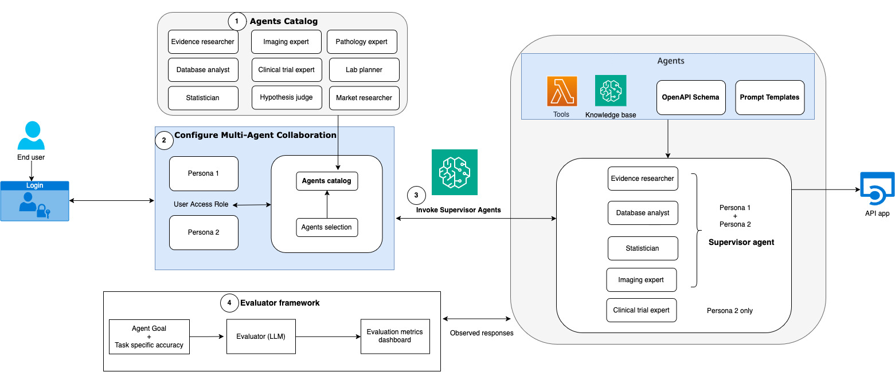
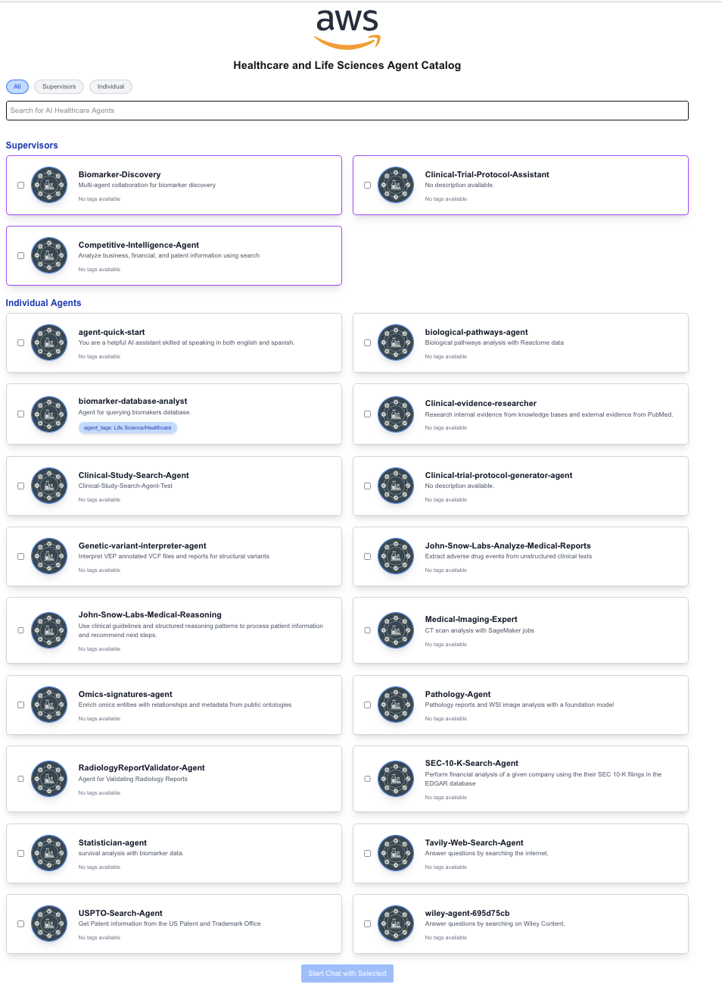

# Sample Healthcare and Life Sciences Agents on AWS

Explore the following components in the repository:

## Agents catalog

Library of specialized agents for common workflows across drug research, clinical trials, and commercialization [agent-catalog](agents_catalog/)

## Multi-agent collaboration

Framework for agent collaboration and knowledge sharing. End to end examples for cancer biomarker discovery, clinical trial protocol assistant, and competitive intelligence. [multi-agent-collaboration](multi_agent_collaboration/)

## Evaluation

Methods for assessing agent performance and result quality. Agent task and goal metrics for cancer biomarker discovery [evaluations](evaluations/)

The key components are illustrated in the diagram below:



## Deployment

### 1. Request Amazon Bedrock model access

Request access to the following Amazon Bedrock foundation models using the [official documentation](https://docs.aws.amazon.com/bedrock/latest/userguide/model-access.html).

- Amazon Titan Embeddings G1 - Text
- Amazon Nova Pro
- Anthropic Claude 3.5 Sonnet
- Anthropic Claude 3.5 Sonnet v2
- Anthropic Claude 3 Sonnet

### 2. Request service quota increase

[Request an increase](https://docs.aws.amazon.com/servicequotas/latest/userguide/request-quota-increase.html#quota-console-increase) of the Amazon Bedrock "Parameters per function" quota to at least 10.

### 3. Deploy the toolkit application and agents for your preferred region

Choose _Launch Stack_ for your preferred region to deploy the toolkit application and selected agents into your AWS account. It may take up to 30 minutes to finish the deployment.

| Name | us-east-1 | us-west-2 |
| -- | ---------- | ----------------- |
| All resources | [](https://console.aws.amazon.com/cloudformation/home?region=us-east-1#/stacks/new?stackName=hcls-agent-toolkit&templateURL=https://aws-hcls-ml.s3.us-east-1.amazonaws.com/public_assets_support_materials/hcls_agents_toolkit/Infra_cfn.yaml) | [](https://console.aws.amazon.com/cloudformation/home?region=us-west-2#/stacks/new?stackName=hcls-agent-toolkit&templateURL=https://aws-hcls-ml.s3.us-east-1.amazonaws.com/public_assets_support_materials/hcls_agents_toolkit/Infra_cfn.yaml) |

This will deploy the following agents:

- Cancer Biomarker Discovery (Multi-Agent Supervisor)
- Biomarker Database Analyst
- Clinical Evidence Researcher
- Medical Imaging Expert
- Statistician
- Clinical Trial Protocol Assistant (Multi-Agent Supervisor)
- Clinical Study Research Agent
- Clinical Trial Protocol Generator Agent
- Wiley Open Access Life Sciences Agent
- Competitive Intelligence (Multi-Agent Supervisor)
- SEC 10-K Search Agent
- Tavily Web Search Agent
- USPTO Search Agent

In most cases, you may leave the default template parameters unchanged. However, several parameters require new values:

- **ReactAppAllowedCidr**: CIDR range from where access to the React UI is allowed. Learn about best practices in the [AWS VPC documentation](https://aws.amazon.com/what-is/cidr/). To restrict React App UI access to just your IP, first find your IP address through public websites such as [WhatIsMyIpAddress](https://whatismyipaddress.com/) and suffix it with 32. For example, if your ip adress is `192.0.2.0` the minimal CIDR range would be `192.0.2.0/32`.

- **RedshiftPassword**: Password for Redshift database login. Remember and store password securely. Must be at least 8 characters long and contain at least one uppercase letter, one lowercase letter, and one number. Only printable ASCII characters, spaces, and the `/`, `@`, `"`, and `'` values may be used.

- **TavilyApiKey**: API key for the Tavily web search API. Required to deploy the Tavily Web Search and Competitive Intelligence Supervisor agents. Please visit [tavily.com](https://tavily.com/) to create a account and generate an API key.
- **USPTOApiKey**: API key for the US Patent and Trademark Office (USPTO) Open Data Portal. Required to deploy the USPTO Search and Competitive Intelligence Supervisor agents. Please visit the [USPO Open Data Portal](https://data.uspto.gov/apis/getting-started) to create a account and generate an API key.

### 4. Access the toolkit application

1. Navigate to AWS CloudFormation via AWS Console search
2. Click the parent stack name that was chosen to deploy the `Infra_cfn.yaml`
3. In the Outputs tab, find the `ReactAppExternalURL` link and add 'https://' to the beginning of the URL and paste in your browser
4. You should be able to see a landing page with all (or a subset) deployed agents as shown in the [video](https://d2dnsxs0d2upyb.cloudfront.net/agents-demo/agents_toolkit_overview.mp4) below:

[](https://d2dnsxs0d2upyb.cloudfront.net/agents-demo/agents_toolkit_overview.mp4)

## Multi-agent collaboration for cancer biomarker discovery

Read more about sample agents to accelerate analysis and discovery of cancer biomarkers:
<https://aws.amazon.com/blogs/machine-learning/accelerate-analysis-and-discovery-of-cancer-biomarkers-with-amazon-bedrock-agents/>

The multi-agent solution overview of [Cancer biomarker discovery](multi_agent_collaboration/cancer_biomarker_discovery/README.md) is illustrated below.


## Model Context Protocol (MCP)

The [Tavily web search](agents_catalog/11-Tavily-web-search-agent/README.md) and [USPTO search](agents_catalog/14-USPTO-search/README.md) tools can be added to your MCP client of choice using the [AWS Lambda MCP Server](https://awslabs.github.io/mcp/servers/lambda-mcp-server/). After installing one of both of them, you can add them to your MCP client configuration:

```json
"hcls-agents": {
   "args": ["awslabs.lambda-mcp-server"],
   "env": {
         "AWS_ACCESS_KEY_ID": "<YOUR AWS ACCESS KEY ID>",
         "AWS_SECRET_ACCESS_KEY": "<YOUR AWS SECRET ACCESS KEY>",
         "AWS_SESSION_TOKEN":"<YOUR AWS SESSION TOKEN>",
         "AWS_REGION": "YOUR AWS REGION",
         "FUNCTION_TAG_KEY": "Application",
         "FUNCTION_TAG_VALUE": "HCLSAgents",
   },
   "command": "uvx"
}
```

Depending on your local environment, you may need to provide the full path to your `uvx` executable. View the [installation instructions](https://awslabs.github.io/mcp/servers/lambda-mcp-server/#installation) for more ways to provide AWS credentials to the tools.

## Contributing Guidelines

### Setting Up Your Development Environment

1. Fork the repository to your GitHub account. Ensure the fork remains public during development and testing.

2. Clone your forked repository to your local machine.

3. Update the GitHub URL in the following configuration files to point to your forked repository:
   - `infra_cfn.yaml`
   - `agent_build.yaml`
   - `streamlit_build.yaml`

4. For testing purposes, deploy the `infra_cfn.yaml` template to AWS CloudFormation.

### Submitting a Pull Request

**Follow the guidelines to contribute a new agent to the catalog here: [add-a-new-agent](https://aws-samples.github.io/amazon-bedrock-agents-healthcare-lifesciences/guides/)

1. Ensure you have forked the main repository: [amazon-bedrock-agents-healthcare-lifesciences](https://github.com/aws-samples/amazon-bedrock-agents-healthcare-lifesciences/tree/main)

2. Create a new branch in your forked repository for your changes.

3. Implement your changes, following the project's coding standards and guidelines.

4. Commit your changes with clear, concise commit messages.

5. Push your branch to your forked repository on GitHub.

6. Open a pull request from your branch to the main repository's `main` branch.

7. Provide a clear description of your changes in the pull request, including any relevant issue numbers.

8. Be prepared to address any feedback or questions during the code review process.

## License

This project is licensed under the MIT-0 License.

## Legal Notes

**<span style="color:RED">Important</span>**: This solution is for demonstrative purposes only. It is not for clinical use and is not a substitute for professional medical advice, diagnosis, or treatment. **The associated notebooks, including the trained model and sample data, are not intended for production.** It is each customers’ responsibility to determine whether they are subject to HIPAA, and if so, how best to comply with HIPAA and its implementing regulations. Before using AWS in connection with protected health information, customers must enter an AWS Business Associate Addendum (BAA) and follow its configuration requirements.
