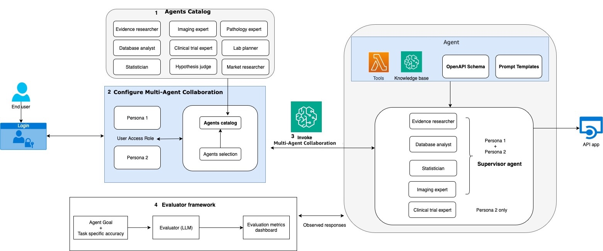

# Sample Healthcare and Life Sciences Agents on AWS

Explore the following components in the repository:

## Agents catalog

Library of specialized agents for common workflows across drug research, clinical trials, and commercialization [agent-catalog](agents_catalog/README.md)

## Multi-agent collaboration

Framework for agent collaboration and knowledge sharing. End to end examples for cancer biomarker discovery, clinical trial protocol assistant, and competitive intelligence. [multi-agent](multi_agent_collaboration/README.md)

## Evaluation

Methods for assessing agent performance and result quality. Agent task and goal metrics for cancer biomarker discovery [evaluations](evaluations/README.md)

The key components are illustrated in the diagram below:



## Deployment

### Note: You can choose to deploy some of the agents with one-click deployment or set them up yourself in workshop mode

> [!IMPORTANT]  
> Access to Amazon Bedrock foundation models (not granted by default). To gain access, follow the [official documentation](https://docs.aws.amazon.com/bedrock/latest/userguide/model-access.html).

> [!NOTE]  
> Full deployment takes approximately 20-30 minutes. 

1. Stack can be launched in us-east-1 or us-west-2 by clicking launch stack below

|   Region   | infra_cfn.yaml |
| ---------- | ----------------- |
| us-east-1  | [](https://console.aws.amazon.com/cloudformation/home?region=us-east-1#/stacks/new?stackName=biomakeragent&templateURL=https://aws-blogs-artifacts-public.s3.amazonaws.com/artifacts/ML-16901/Infra_cfn.yaml)|
| us-west-2  | [](https://console.aws.amazon.com/cloudformation/home?region=us-west-2#/stacks/new?stackName=biomakeragent&templateURL=https://aws-blogs-artifacts-public.s3.amazonaws.com/artifacts/ML-16901/Infra_cfn.yaml)|

Alternatively, upload the `Infra_cfn.yaml` file from the [amazon-bedrock-agents-healthcare-lifesciences](https://github.com/aws-samples/amazon-bedrock-agents-healthcare-lifesciences) repository to AWS CloudFormation. (Details of how to create a stack are shown [here](https://docs.aws.amazon.com/AWSCloudFormation/latest/UserGuide/cfn-console-create-stack.html)).

This template will set up:
> [!WARNING]  
> Launching this stack will create 2 VPCs (Infrastructure and UI).

   - Networking infrastructure (VPC, Subnets, etc.)
   - Amazon Redshift database
   - Bedrock Agent with Actions
   - Knowledgebase
   - Streamlit UI frontend
   - React App UI frontend


2. Deploy the `Infra_cfn.yaml` template:
   - Default parameter values can remain unchanged
   - Parameter descriptions:
     - `BedrockModelId`: ID of the Foundation Model for the Agent (permissions scoped to Anthropic Claude 3 Sonnet model)
     - `EnvironmentName`: Differentiates the application if launched in the same AWS account (lowercase, one number, max 5 characters)
     - `RedshiftDatabaseName`: Name for the Redshift database
     - `RedshiftUserName`: Username for Redshift database login
     - `RedshiftPassword`: Password for Redshift database login [Remember and store password securely]
     - `GithubLink`: Default repository for the Agent (do not change)
     - `ImageTag`: Tag of the Docker image for Streamlit UI deployment
     - `ReactAppAllowedCidr`: CIDR range from where access to the React UI is allowed
     - `MultiAgentDevMode`: Select True to use a python notebook to manually create the agents step by step. Select false to auto create a subset of agents.

3. After stack launch is successful manually sync the Knowledgebase:
   1. Navigate to the Bedrock dashboard via AWS Console search
   2. Click the option icon (top left) to open the navigation bar
   3. Select "Knowledge bases" under the "Builder tools" tab
   4. Choose the Knowledgebase created by the CloudFormation template
   5. Scroll to the "Data Source" option box
   6. Select the data source (radio button) and click "Sync"

4. Access the React UI:
   1. Navigate to AWS CloudFormation via AWS Console search
   2. Click the parent stack name that was chosen to deploy the `Infra_cfn.yaml`
   3. In the Outputs tab, find the `ReactAppExternalURL` link and add 'https://' to the beginning of the URL and paste in your browser
   4. You should be able to see a landing page with all (or a subset) deployed agents as shown in the screenshot below:
   
    

## Multi-agent collaboration for cancer biomarker discovery

Read more about sample agents to accelerate analysis and discovery of cancer biomarkers:
<https://aws.amazon.com/blogs/machine-learning/accelerate-analysis-and-discovery-of-cancer-biomarkers-with-amazon-bedrock-agents/>

The multi-agent solution overview of [Cancer biomarker discovery](multi_agent_collaboration/cancer_biomarker_discovery/README.md) is illustrated below.

 

## Model Context Protocol (MCP)

The [Tavily web search](agents_catalog/11-Tavily-web-search-agent/README.md) and [USPTO search](agents_catalog/14-USPTO-search/README.md) tools can be added to your MCP client of choice using the [AWS Lambda MCP Server](https://awslabs.github.io/mcp/servers/lambda-mcp-server/). After installing one of both of them, you can add them to your MCP client configuration:

```json
"hcls-agents": {
   "args": ["awslabs.lambda-mcp-server"],
   "env": {
         "AWS_ACCESS_KEY_ID": "<YOUR AWS ACCESS KEY ID>",
         "AWS_SECRET_ACCESS_KEY": "<YOUR AWS SECRET ACCESS KEY>",
         "AWS_SESSION_TOKEN":"<YOUR AWS SESSION TOKEN>",
         "AWS_REGION": "YOUR AWS REGION",
         "FUNCTION_TAG_KEY": "Application",
         "FUNCTION_TAG_VALUE": "HCLSAgents",
   },
   "command": "uvx"
}
```

Depending on your local environment, you may need to provide the full path to your `uvx` executable. View the [installation instructions](https://awslabs.github.io/mcp/servers/lambda-mcp-server/#installation) for more ways to provide AWS credentials to the tools.

## Contributing Guidelines

### Setting Up Your Development Environment

1. Fork the repository to your GitHub account. Ensure the fork remains public during development and testing.

2. Clone your forked repository to your local machine.

3. Update the GitHub URL in the following configuration files to point to your forked repository:
   - `infra_cfn.yaml`
   - `agent_build.yaml`
   - `streamlit_build.yaml`

4. For testing purposes, deploy the `infra_cfn.yaml` template to AWS CloudFormation.

### Submitting a Pull Request

**Follow the guidelines to contribute a new agent to the catalog here: [add-a-new-agent](https://aws-samples.github.io/amazon-bedrock-agents-healthcare-lifesciences/guides/)

1. Ensure you have forked the main repository: [amazon-bedrock-agents-healthcare-lifesciences](https://github.com/aws-samples/amazon-bedrock-agents-healthcare-lifesciences/tree/main)

2. Create a new branch in your forked repository for your changes.

3. Implement your changes, following the project's coding standards and guidelines.

4. Commit your changes with clear, concise commit messages.

5. Push your branch to your forked repository on GitHub.

6. Open a pull request from your branch to the main repository's `main` branch.

7. Provide a clear description of your changes in the pull request, including any relevant issue numbers.

8. Be prepared to address any feedback or questions during the code review process.

## License

This project is licensed under the MIT-0 License.

## Legal Notes

**<span style="color:RED">Important</span>**: This solution is for demonstrative purposes only. It is not for clinical use and is not a substitute for professional medical advice, diagnosis, or treatment. **The associated notebooks, including the trained model and sample data, are not intended for production.** It is each customers’ responsibility to determine whether they are subject to HIPAA, and if so, how best to comply with HIPAA and its implementing regulations. Before using AWS in connection with protected health information, customers must enter an AWS Business Associate Addendum (BAA) and follow its configuration requirements.
