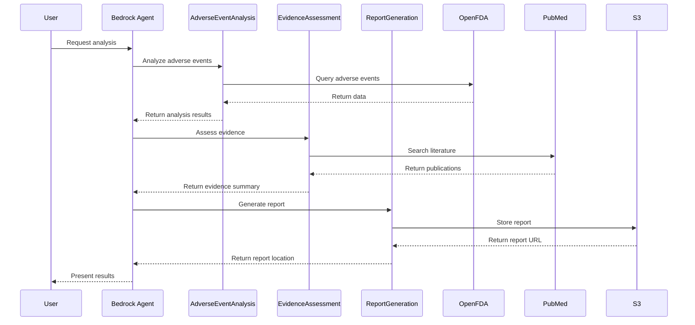

# Safety Signal Detection Agent Design

## System Architecture

### Components

1. **Amazon Bedrock Agent**
   - Handles natural language interactions
   - Routes requests to appropriate action groups
   - Manages conversation context and flow

2. **Action Groups**
   - **AdverseEventAnalysis**
     - Processes OpenFDA data
     - Performs statistical analysis
     - Detects safety signals
   - **EvidenceAssessment**
     - Searches medical literature
     - Retrieves label information
     - Evaluates evidence strength
   - **ReportGeneration**
     - Generates standardized reports
     - Stores reports in S3

3. **External APIs**
   - OpenFDA API for adverse event data
   - PubMed E-utilities for literature search
   - FDA Label API for product information

### Data Flow



## Action Group Details

### AdverseEventAnalysis

#### Input Parameters
- `product_name` (string, required): Name of the product to analyze
- `time_period` (integer, optional): Analysis period in months (default: 6)
- `signal_threshold` (float, optional): PRR threshold for signal detection (default: 2.0)

#### Processing Steps
1. Query OpenFDA for adverse event reports
   - Retrieve data in batches of 100 records
   - Maximum total of 1000 records
   - First batch includes total available count
   - Use skip parameter for pagination
2. Calculate reporting frequencies
3. Perform PRR analysis
4. Identify significant signals
5. Generate trend analysis

#### Output Format
```json
{
  "product_name": "string",
  "analysis_period": {
    "start": "datetime",
    "end": "datetime"
  },
  "total_reports": "integer",
  "signals": [
    {
      "event": "string",
      "count": "integer",
      "prr": "float",
      "confidence_interval": {
        "lower": "float",
        "upper": "float"
      }
    }
  ],
  "trends": {
    "daily_counts": "object",
    "moving_average": "object"
  }
}
```

### EvidenceAssessment

#### Input Parameters
- `product_name` (string, required): Product name
- `adverse_event` (string, required): Adverse event term
- `include_pubmed` (boolean, optional): Include PubMed search (default: true)
- `include_label` (boolean, optional): Include FDA label info (default: true)

#### Processing Steps
1. Search PubMed for relevant literature
2. Retrieve FDA label information
3. Assess causality based on evidence
4. Combine evidence sources

#### Output Format
```json
{
  "product_name": "string",
  "adverse_event": "string",
  "literature": [
    {
      "title": "string",
      "abstract": "string",
      "year": "string",
      "pmid": "string"
    }
  ],
  "label_info": {
    "warnings": ["string"],
    "adverse_reactions": ["string"],
    "boxed_warnings": ["string"],
    "contraindications": ["string"]
  },
  "causality_assessment": {
    "evidence_level": "string",
    "causality_score": "integer",
    "assessment_date": "datetime"
  }
}
```

### ReportGeneration

#### Input Parameters
- `analysis_results` (string, required): JSON string of analysis results
- `evidence_data` (string, required): JSON string of evidence data

#### Processing Steps
1. Parse input JSON data
2. Generate formatted report
3. Upload report to S3
4. Return report location

#### Output Format
```json
{
  "report_url": "string",
  "timestamp": "datetime"
}
```

## Error Handling

### API Errors
- Retry logic for transient failures
- Graceful degradation for service unavailability
- Clear error messages for invalid inputs

### Rate Limiting
- Respect API rate limits
- Implement backoff strategies
- Queue requests when necessary

### Data Quality
- Validate input parameters
- Handle missing or incomplete data
- Provide data quality indicators

## Security Considerations

### Authentication
- AWS IAM roles for Lambda functions
- API keys for external services
- S3 bucket policies

### Data Protection
- Encryption at rest for stored reports
- Secure API communications
- Input sanitization

### Access Control
- Role-based access to reports
- Audit logging
- Resource-level permissions

## Monitoring and Logging

### CloudWatch Metrics
- API latency and success rates
- Lambda function performance
- Error rates and types

### Logging
- Structured logging format
- Log levels for debugging
- Request tracing

### Alerts
- Error rate thresholds
- API availability
- Resource utilization
