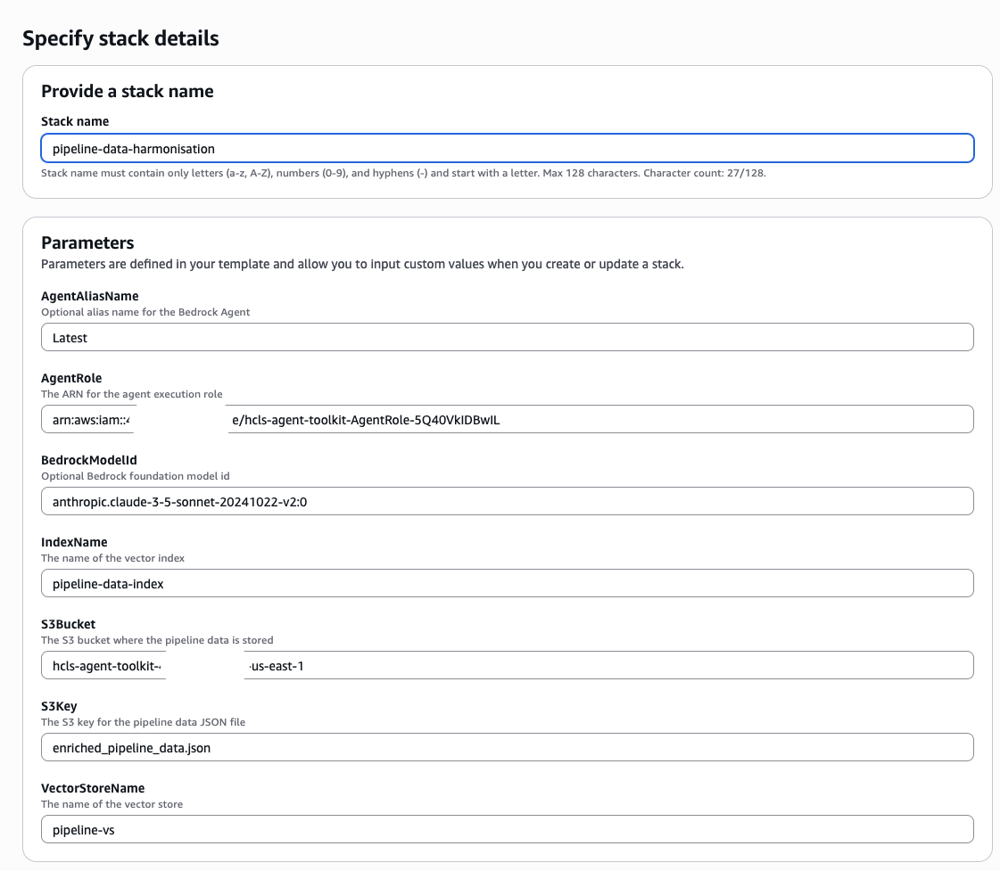

# Data Harmonisation for Drug Development Pipeline

This solution automatically collects, standardizes, and enriches drug development pipeline data from pharmaceutical companies. It uses an agentic approach to answer questions related to drug development pipelines.

## Problem Statement

Harmonizing data from disparate systems is time-consuming and costly. Pharmaceutical companies publish their drug development pipelines on their websites, but analyzing this data systematically presents several challenges:

- Manual downloading is often required
- Each company reports data in their own format
- Key data fields (indication, compound name, etc.) are reported inconsistently
- No standardized ontologies or controlled vocabularies are applied

An automated solution that retrieves, extracts, compiles data to a common data model, and standardizes with ontologies is essential to make the data FAIR (Findable, Accessible, Interoperable, Reusable) and ready for downstream analysis.

## Sample Questions
- "What diabetes drug candidates are in Phase 1 development?"
- "Compare the pipeline strategies of Novo Nordisk vs Novartis"
- "Which compounds have Fast Track designation?"
- "Show me all biologics targeting oncology indications"
- "Analyze the distribution of development phases across therapeutic areas"

## Solution Overview

### Prerequisites

This project demonstrates how to extract and process pharmaceutical pipeline data using Amazon Q CLI and simple prompts. Sample data is collected from [Pfizer](https://www.pfizer.com/science/drug-product-pipeline), [Novo Nordisk](https://www.novonordisk.com/science-and-technology/r-d-pipeline.html), and [Novartis](https://www.novartis.com/research-development/novartis-pipeline). Our solution respectfully follows robots.txt directives, only collecting data from websites that permit it.

#### Data Collection Process
The data is collected and harmonized as a prerequisite step using [Amazon Q CLI](https://docs.aws.amazon.com/amazonq/latest/qdeveloper-ug/command-line.html), which is a command-line interface for Amazon Q, an AI-powered coding assistant. The implementation primarily uses Fetch MCP to crawl company pipeline webpages and download the data. Please see the `pipeline_data` folder for step-by-step data collection instructions. Below is an explanation of each step.

The final data is saved as a JSON file in `pipeline_data/final_enriched_data/enriched_pipeline_data.json`, ready for downstream analysis. For implementation details, please see `./pipeline_data/PROJECT_SUMMARY.md`.

##### Step 1: Data Collection
Using [Fetch MCP](https://github.com/modelcontextprotocol/servers/tree/main/src/fetch) to collect data from Novartis, Novo Nordisk, and Pfizer pipeline web pages, extracting the data and saving it as individual JSON objects.

##### Step 2: Common Data Model Creation
Analyzing each JSON file to create a unified data model that represents all collected data. This step combines data from the three companies into a single dataset.

##### Step 3: Data Standardization and Enrichment
Automatically detecting appropriate ontologies to standardize the data, ensuring consistency across all entries.

##### Key Ontologies Used
This project leverages several standardized biomedical ontologies to ensure data interoperability and semantic enrichment. These ontologies provide controlled vocabularies and hierarchical relationships that enable consistent data representation across pharmaceutical pipeline information.
1. [MONDO (Monarch Disease Ontology)](https://mondo.monarchinitiative.org)
   - Comprehensive disease ontology for standardizing disease names and classifications
   - Used for harmonizing disease indications across pharmaceutical pipelines

2. [ChEBI (Chemical Entities of Biological Interest)](https://www.ebi.ac.uk/chebi/)
   - Structured classification of molecular entities focused on small chemical compounds
   - Applied to standardize compound types and mechanisms of action

3. [EFO (Experimental Factor Ontology)](https://www.ebi.ac.uk/efo/)
   - Provides systematic descriptions of experimental variables
   - Used for therapeutic area standardization and classification

4. [NCIT (NCI Thesaurus)](https://ncithesaurus.nci.nih.gov/)
   - Comprehensive cancer and biomedical terminology
   - Applied to development phases, regulatory designations, and compound classifications

5. [MeSH (Medical Subject Headings)](https://www.nlm.nih.gov/mesh/)
   - Controlled vocabulary thesaurus for indexing biomedical information
   - Used for disease and therapeutic area standardization

6. [ATC (Anatomical Therapeutic Chemical Classification)](https://www.whocc.no/atc/)
   - Hierarchical system for classifying drugs by therapeutic use
   - Applied to therapeutic area standardization

7. [ICD-10 (International Classification of Diseases)](https://icd.who.int/)
   - Standard diagnostic classification for epidemiology and clinical purposes
   - Used for disease indication standardization

8. [SNOMED CT (Systematized Nomenclature of Medicine Clinical Terms)](https://www.snomed.org/)
   - Comprehensive clinical healthcare terminology
   - Applied to disease indication standardization

### Pipeline Data Agent
This implementation uses Amazon Bedrock agents with knowledge bases to answer questions about pharmaceutical companies' new product development pipelines. The final data created in the preprocessing step `pipeline_data/final_enriched_data/enriched_pipeline_data.json` is ingested as a knowledge base. The Amazon Bedrock agent uses the knowledge base as a tool to answer questions from users. 

The agent can answer natural language questions about drug development pipelines, do cross-company analysis, provide insights on development phase or therapeutic area and more. 

To create the agent and the knowledge base, use the CloudFormation template in this directory. Step-by-step deployment instructions are below. 

#### Alternative Approaches

Alternatively, you could also:

- Create an agent to collect the data using Strands SDK (https://strandsagents.com/latest/), which has native support for MCP as tools
- Utilize the inline agent feature in Amazon Bedrock Agents to connect to the MCP 

Our current solution focuses on using Q CLI for data collection and preparation, which offers a straightforward approach to gathering pharmaceutical pipeline information.

## Next Steps

Going forward, 
- this agent can be enhaced to dynamically collect and harmonise data based on user requrest
- Add FDA IND (Investigational New Drug) application data to cross-reference company pipeline announcements with actual FDA submissions or Analyze regulatory pathway strategies and approval probabilities
- Add Clinical Trial (ct.gov) data to verify pipeline compounds against active clinical trials or monitor actual vs. planned study completion dates

## Deployment

The solution deployment automation script uses a parameterized CloudFormation template, `pipeline-data-agent-cfn.yaml`, to automate provisioning of the following solution resources:
- OpenSearch Service Serverless
- Amazon Bedrock KnowledgeBase
- Amazon Bedrock Agent
- IAM Roles

Please note that you need **S3Bucket** and **AgentRole** from the main stack. 

```bash
aws cloudformation deploy \
  --template-file /Users/necibea/Documents/GitHub/HCLS_Agents_Toolkit/amazon-bedrock-agents-healthcare-lifesciences/agents_catalog/23-data-harmonisation-drug-dev-pipeline/pipeline-data-agent-cfn.yaml \
  --capabilities CAPABILITY_IAM CAPABILITY_NAMED_IAM \
  --stack-name pipeline-data-agent \
  --parameter-overrides \
    S3Bucket=your-s3-bucket-name \
    AgentRole=arn:aws:iam::your-account-id:role/your-agent-execution-role \
    S3Key=enriched_pipeline_data.json \
    BedrockModelId=anthropic.claude-3-5-sonnet-20241022-v2:0 \
    AgentAliasName=Latest \
    IndexName=pipeline-data-index
```


After successful deployment, sync your data source:
- From the Amazon Console, locate Amazon Bedrock
- In Knowledge Bases, find the knowledge base that includes 'PipelineData' in the name
- In Data source, click on the data source and select Sync


### Troubleshooting
If your stack fails, please check the following:

1. **Data is uploaded to S3**
   - From the Amazon Console
   - Go to S3 and find the S3 bucket
   - Check if `enriched_pipeline_data.json` is there. Upload it if it isn't. 

2. **Index is created in Amazon OpenSearch Serverless**
   1. Go to Amazon OpenSearch Serverless
      - Collections
      - Find `pipeline-rag`
      - Select `Create index`
        - Index name: `pipeline-data-index`
        - Vector field name: `pipeline-vs`
        - Engine: `faiss`
        - Precision: `FP16`
        - Dimensions: `1536`
        - Distance metric: `Euclidean`